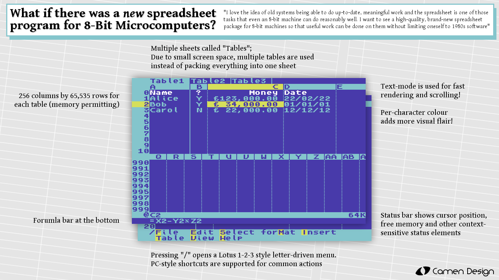

# ZSheet #

## What If There Was A _New_ Spreadsheet Program For 8-Bit Microcomuters? ##

> "I love the idea of old systems being able to do up-to-date, meaningful work and the spreadsheet is one of those
tasks that even an 8-bit machine can do reasonably well. I want to see a high-quality, brand-new spreadsheet
package for 8-bit machines so that useful work can be done on them without limiting oneself to 1980s software"

I made this to satisfy my curiosity that a fast-scrolling spreadsheet program could be done on the Commodore 64. I have no intention of taking this project further, but I am providing the code for anybody who would like to pursue this idea.